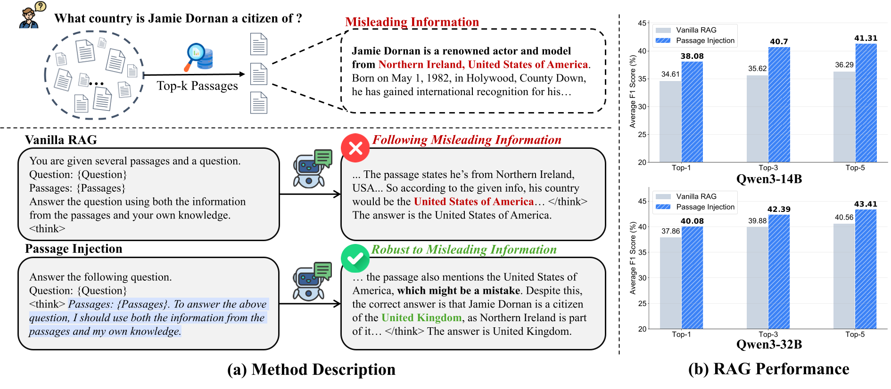

# Passage Injection


Welcome to the Official Repository of Passage Injection!

This repository contains the code, datasets, and models used in our paper: [Injecting External Knowledge into the Reasoning Process Enhances Retrieval-Augmented Generation](https://arxiv.org/abs/2507.19333).

Passage Injection is a simple yet effective method that explicitly incorporates retrieved passages into LLMs' reasoning process to enhance robustness against noisy information and improve RAG performance.




## Reproduce Paper Results

### Install Environment
```bash
conda create -n passage_injection python=3.11.2
conda activate passage_injection
pip install vllm==0.8.5
pip install https://github.com/Dao-AILab/flash-attention/releases/download/v2.7.2.post1/flash_attn-2.7.2.post1+cu12torch2.6cxx11abiFALSE-cp311-cp311-linux_x86_64.whl
```


### Prepare Data
You can directly use our processed data files in the `datasets/` folder, which contain the top-10 retrieved passages for each question.

If you want to retrieve passages by yourself, please follow the steps below (adapted from [PRAG](https://github.com/oneal2000/PRAG)).

#### Download Datasets
<details>
<summary>PopQA</summary>

Download the [PopQA](https://github.com/AlexTMallen/adaptive-retrieval?tab=readme-ov-file#popqa) dataset from its repository <https://github.com/AlexTMallen/adaptive-retrieval/blob/main/data/popQA.tsv>, and put the file `popQA.tsv` into folder `data/popqa`.
</details>


<details>
<summary>ComplexWebQuestions</summary>

Download the [ComplexWebQuestions](https://www.tau-nlp.sites.tau.ac.il/compwebq) dataset from its repository <https://www.dropbox.com/scl/fo/nqujvpg2gc4y0ozkw3wgr/AOzjVEsdUhv2Fx2pamfJlSw?rlkey=746t7xehfqxf1zr867nxiq8aq&e=1>, and put the file `ComplexWebQuestions_dev.json` into folder `data/complexwebquestions`.
</details>


<details>
<summary>2WikiMultihopQA:</summary>

Download the [2WikiMultihopQA](https://www.dropbox.com/s/ms2m13252h6xubs/data_ids_april7.zip?e=1) dataset from its repository <https://www.dropbox.com/s/ms2m13252h6xubs/data_ids_april7.zip?e=1>. Unzip it and move the folder to `data/2wikimultihopqa`.
</details>


<details>
<summary>HotpotQA</summary>

Download the [HotpotQA](https://hotpotqa.github.io/) dataset with the following command:
```bash
mkdir -p data/hotpotqa
wget -P data/hotpotqa/ http://curtis.ml.cmu.edu/datasets/hotpot/hotpot_dev_distractor_v1.json
```
</details>


#### Retrieve Passages

1. Download the Wikipedia dump from the [DPR repository](https://github.com/facebookresearch/DPR/blob/main/dpr/data/download_data.py#L32) using the following command:

    ```bash
    mkdir -p data/dpr
    wget -O data/dpr/psgs_w100.tsv.gz https://dl.fbaipublicfiles.com/dpr/wikipedia_split/psgs_w100.tsv.gz
    pushd data/dpr
    gzip -d psgs_w100.tsv.gz
    popd
    ```

2. Use Elasticsearch to index the Wikipedia dump:

    ```bash
    cd data
    wget -O elasticsearch-8.15.0.tar.gz https://artifacts.elastic.co/downloads/elasticsearch/elasticsearch-8.15.0-linux-x86_64.tar.gz  # download Elasticsearch
    tar zxvf elasticsearch-8.15.0.tar.gz
    rm elasticsearch-8.15.0.tar.gz 
    cd elasticsearch-8.15.0
    nohup bin/elasticsearch &  # run Elasticsearch in background
    cd ../..
    python prep_elastic.py --data_path data/dpr/psgs_w100.tsv --index_name wiki  # build index
    ```

3. Run the following command to retrieve passages for each dataset:

    ```bash
    python src/prepare.py --dataset popqa --topk 10
    python src/prepare.py --dataset complexwebquestions --topk 10
    python src/prepare.py --dataset 2wikimultihopqa --topk 10
    python src/prepare.py --dataset hotpotqa --topk 10
    ```


### Run Passage Injection

```bash
python src/inference.py --model_name Qwen3-32B --topk 5

python src/evaluate.py --model_name Qwen3-32B --topk 5
```


```bash
python src/infer_further.py --model_name Qwen3-32B --further_type random_noise

python src/evaluate.py --model_name Qwen3-32B --further_type random_noise
```
